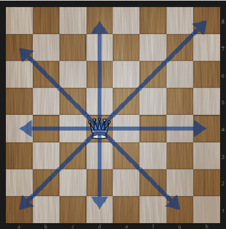
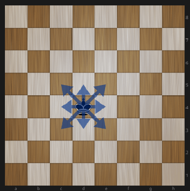

# Шахматные фигуры

1. Создать интерфейс `IChessmen`, который содержит методы `move()`, `getPosition()`.
1. Создать абстрактный класс `AbstractChessmen`, который наследует интерфейс `IChessmen`, имеет свойство ```$x,$y```, реализует функцию `getPosition()`. 
1. Создать класс `King`, который наследует `AbstractChessmen` и реализует метод `move()`. Реализация метода `move()` должна бросать исключение, если фигуру перемещают на недопустимую область (см. рис. 1). Так же нельзя переместить фигуру за край шахматной доски. Функция `move()` должна быть единственной возможностью изменить положение фигуры.
1. Создать класс `Queen`, который наследует `AbstractChessmen` и реализует метод `move()`. Реализация метода `move()` должна бросать исключение, если фигуру перемещают на недопустимую область (см. рис. 2). Так же нельзя переместить фигуру за край шахматной доски. Функция `move()` должна быть единственной возможностью изменить положение фигуры.
1. Создать две фигуры `Queen` на `х=1 y=1`, `King` на `x=4,y=3`.
1. Переместите фигуру `Queen` на `х=7 y=3`, а `King` на `x=2,y=2`.
1. Выведите на экран позицию этих двух фигур.

<figure>
    
    <figcaption>Рис. 1 Допустимая область для <code>King</code></figcaption>
</figure>
<figure>
    
    <figcaption>Рис. 2 Допустимая область для <code>Queen</code></figcaption>
</figure>